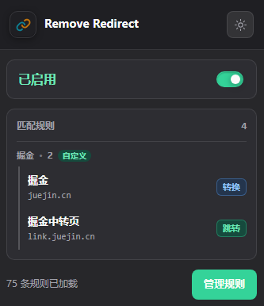
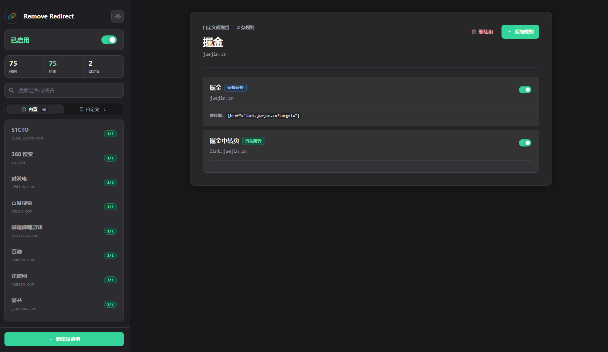

<h1 align="center">
Remove Redirect WebExt
</h1>

一个移除外部链接重定向的拓展，允许配置自定义规则。

基于[maomao1996/tampermonkey-scripts](https://github.com/maomao1996/tampermonkey-scripts)。

## 安装

在 [Releases](https://github.com/Lu-Jiejie/remove-redirect/releases/latest) 下载 `crx` 文件并安装。

## License

MIT
